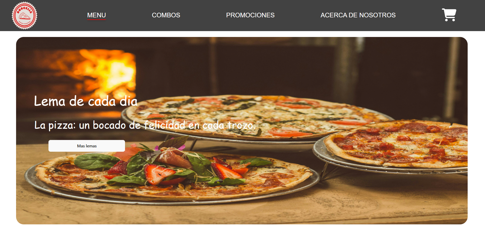

# PROYECTO FINAL - PAGINA DE COMIDA RAPIDA CON REACT

## Componente Principal de la Aplicación de React

En mi archivo App.jsx es la aplicación principal de un proyecto de compras en línea en React. Utiliza react-router-dom para gestionar la navegación entre diferentes rutas. Importa componentes clave como Navbar, Carousel, Card, Footer, Promociones, Home, Acerca y Combos. El estado del carrito de compras se maneja con el hook useState, inicializándolo como un arreglo vacío. La estructura incluye un Router que envuelve la Navbar, la cual recibe cartItems y setCartItems como props para mostrar la cantidad de productos en el carrito. Se definen varias rutas: /home para el componente Home, /menu que combina Carousel, Card y Footer, /combos que renderiza Combos con el estado del carrito, /promo que muestra Promociones y Footer, y /acerca que incluye Acerca y Footer. Esta estructura organiza la aplicación, facilitando la navegación y la gestión del estado del carrito de compras.

## Inicio de la pagina - Home

El componente Home se encarga de mostrar una sección introductoria en la aplicación de compras en línea. Incluye un contenedor de alimentos que presenta un título destacado, "La mejor comida de todos los tiempos", y un mensaje que invita a disfrutar de "¡Pizza deliciosa en tu puerta en poco tiempo!". Además, hay un botón estilizado que, al hacer clic, redirige al usuario a la página del menú mediante un enlace a /menu. El componente también importa estilos desde Home.css para su diseño.

```jsx
import './Home.css';
import { Link } from 'react-router-dom';

export const Home = () => {
    return (
        <>
            <section>
                <div className="food-container">
                    <div className="food-content">
                        <div className="food-items">
                            <h1 className="comida-h1">La mejor comida de todos los tiempos</h1>
                            <p className="comida">¡Pizza deliciosa en tu puerta en poco tiempo!</p>
                            <Link to="/menu">
                                <button className="botone">Descubre nuestro menú</button>
                            </Link>
                        </div>
                    </div>
                </div>
            </section>
        </>
    )
}
```


## Componente de Menú de comida

El componente Carousel implementa un carrusel de imágenes que destaca diferentes promociones y menús en la aplicación. Utiliza una estructura de contenedor que incluye una sección estática con un lema sobre la pizza y un botón para ver más lemas. El carrusel muestra varias imágenes de productos, cada una en un carousel-item, y permite navegar entre ellas mediante botones de control "anterior" y "siguiente". Las imágenes están estilizadas para ocupar el ancho completo del contenedor y tienen un ajuste de objeto para mantener la proporción. Además, incluye un encabezado que invita a los usuarios a conocer el menú y promociones disponibles.

```jsx
import "./Carousel.css";

export const Carousel = () => {
  return (
    <>
    <div className="container">
     
      <section className="static-section">
        
        <div className="text-content">
          <h1>Lema de cada dia</h1>
          <p className="lemas">La pizza: un bocado de felicidad en cada trozo.</p>
          <button className="boton">Mas lemas</button>
        </div>
      </section>

      <div>
        <h2 className="encabezado">CONOCE NUESTRO MENÚ Y PROMOCIONES!</h2>
        <hr></hr>
      </div>

     
      <div id="carouselExample" className="carousel mycarousel slide" style={{ borderRadius: "10px", overflow: "hidden" }}>
        <div className="carousel-inner">
          
          <div className="carousel-item active">
            
          </div>
          
          <div className="carousel-item">
            
          </div>
         
          <div className="carousel-item">
            
          </div>
        </div>
        
       
        <button
          className="carousel-control-prev"
          type="button"
          data-bs-target="#carouselExample"
          data-bs-slide="prev"
        >
          <span className="carousel-control-prev-icon" aria-hidden="true"></span>
          <span className="visually-hidden">Previous</span>
        </button>
        
        
        <button
          className="carousel-control-next"
          type="button"
          data-bs-target="#carouselExample"
          data-bs-slide="next"
        >
          <span className="carousel-control-next-icon" aria-hidden="true"></span>
          <span className="visually-hidden">Next</span>
        </button>
      </div>
    </div>
    </>
  );
};
```



## Componente de Combos de comida

El componente Combos se encarga de mostrar una lista de combos disponibles en la aplicación. Utiliza useState para gestionar el estado de los productos y useEffect para obtener los datos de los combos desde una API local al cargar el componente. La estructura incluye dos subcomponentes: Cartas, que representa cada combo con su imagen, título, precio y un botón "COMPRAR!", y CombosList, que renderiza múltiples Cartas en un diseño flexible.

Al hacer clic en "COMPRAR!", se verifica si el combo ya está en el carrito. Si es así, se actualiza la cantidad; si no, se agrega como nuevo elemento. El estado del carrito se guarda en localStorage para persistir los datos. Además, el componente incluye un carrusel que muestra imágenes de los combos disponibles, con controles para navegar entre ellas.

```jsx
import { useEffect, useState } from 'react';
import './Combos.css';

const Cartas = ({ imagen, titulo, precio, onBuy }) => {
    return (
        <div className="card carta" style={{ width: '18rem' }}>
            
            <div className="carta card-body">
                <h5 className="titulo card-title">{titulo}</h5>
                <p className="precio card-price">{precio}</p>
                <button className="btn btn-secundary" onClick={onBuy}>COMPRAR!</button>
            </div>
        </div>
    );
};

const CombosList = ({ combos, onBuy }) => {
    return (
        <div className="d-flex flex-wrap justify-content-around">
            {combos.map((combo) => (
                <Cartas 
                    key={combo.id} 
                    imagen={combo.imagen} 
                    titulo={combo.nombre} 
                    precio={combo.costo} 
                    onBuy={() => onBuy(combo)} 
                />
            ))}
        </div>
    );
};

export const Combos = ({ cartItems, setCartItems }) => {
    const [productos, setProductos] = useState({ combos: [] });

    useEffect(() => {
        const fetchData = async () => {
            const response = await fetch('http://localhost:3000/productos');
            const data = await response.json();
            setProductos(data);
        };

        fetchData();
    }, []);

    const handleBuy = (combo) => {
        const existingItem = cartItems.find(item => item.id === combo.id);
        if (existingItem) {
            const updatedCart = cartItems.map(item =>
                item.id === combo.id
                    ? { ...item, quantity: item.quantity + 1 }
                    : item
            );
            setCartItems(updatedCart);
            localStorage.setItem('cartItems', JSON.stringify(updatedCart));
        } else {
            const updatedCart = [...cartItems, { ...combo, quantity: 1 }];
            setCartItems(updatedCart);
            localStorage.setItem('cartItems', JSON.stringify(updatedCart));
        }
    };

    return (
        <>
            <section>
                <div id="carouselExample" className="carousel myslide slide" style={{ borderRadius: "10px", overflow: "hidden" }}>
                    <div className="carousel-inner">
                        <div className="carousel-item active">
                            
                        </div>
                        <div className="carousel-item">
                            
                        </div>
                    </div>
                    <button className="carousel-control-prev" type="button" data-bs-target="#carouselExample" data-bs-slide="prev">
                        <span className="carousel-control-prev-icon" aria-hidden="true"></span>
                        <span className="visually-hidden">Previous</span>
                    </button>
                    <button className="carousel-control-next" type="button" data-bs-target="#carouselExample" data-bs-slide="next">
                        <span className="carousel-control-next-icon" aria-hidden="true"></span>
                        <span className="visually-hidden">Next</span>
                    </button>
                </div>
            </section>

            <div>
                <h2 className='Combos' id='Combos'>COMBOS DISPONIBLES</h2>
            </div>

            <CombosList combos={productos.combos} onBuy={handleBuy} />
        </>
    );
};
```


## Componente de las Promociones de comida 

El componente Promociones se encarga de mostrar varias categorías de productos disponibles en la aplicación, incluyendo pizzas, hamburguesas, bebidas y helados. Utiliza useState para manejar el estado de los productos y useEffect para realizar una solicitud a una API local (http://localhost:3000/productos) al montar el componente, cargando los datos de los productos en un objeto con cuatro categorías.

Dentro del componente, se define la subcomponente Card, que representa cada producto con su imagen, título, precio y un botón "COMPRAR!", permitiendo al usuario añadir el producto al carrito. La subcomponente CardList organiza las pizzas en un carrusel, dividiendo las pizzas en dos grupos para una visualización más clara. Para las hamburguesas, bebidas y helados, se utilizan subcomponentes específicos: BurgerCardList, DrinkCardList e IceCreamCardList, que muestran los productos en un diseño flexible utilizando d-flex de Bootstrap.

La funcionalidad de compra se gestiona a través de la función handleBuy, que se activa al hacer clic en el botón "COMPRAR!". Esta función verifica si el producto ya está en el carrito. Si el producto existe, se incrementa su cantidad; si no, se añade como un nuevo elemento al carrito. El estado del carrito se actualiza usando setCartItems, lo que asegura que los cambios se reflejen en la interfaz de usuario.

Además, el componente incluye un carrusel en la parte superior que muestra imágenes promocionales, permitiendo a los usuarios navegar entre diferentes ofertas visualmente atractivas.

```jsx
import { useEffect, useState } from 'react';
import './Promo.css';

const Card = ({ imgSrc, title, price, onBuy }) => {
    return (
        <div className="card" style={{ width: '18rem' }}>
            
            <div className="card-body">
                <h5 className="card-title">{title}</h5>
                <p className="card-price">{price}</p>
                <button className="btn btn-secundary" onClick={onBuy}>COMPRAR!</button>
            </div>
        </div>
    );
};

const CardList = ({ pizzas, onBuy }) => {
    return (
        <div id="cardCarousel" className="carousel mycard slide" data-bs-ride="carousel">
            <div className="carousel-inner">
                <div className="carousel-item active">
                    <div className="d-flex justify-content-around">
                        {pizzas.slice(0, 3).map((pizza) => (
                            <Card 
                                key={pizza.id} 
                                imgSrc={pizza.imagen} 
                                title={pizza.nombre} 
                                price={pizza.costo} 
                                onBuy={() => onBuy(pizza)} 
                            />
                        ))}
                    </div>
                </div>
                <div className="carousel-item">
                    <div className="d-flex justify-content-around">
                        {pizzas.slice(3).map((pizza) => (
                            <Card 
                                key={pizza.id} 
                                imgSrc={pizza.imagen} 
                                title={pizza.nombre} 
                                price={pizza.costo} 
                                onBuy={() => onBuy(pizza)} 
                            />
                        ))}
                    </div>
                </div>
            </div>
            <button className="carousel-control-prev" type="button" data-bs-target="#cardCarousel" data-bs-slide="prev">
                <span className="carousel-control-prev-icon" aria-hidden="true"></span>
                <span className="visually-hidden">Previous</span>
            </button>
            <button className="carousel-control-next" type="button" data-bs-target="#cardCarousel" data-bs-slide="next">
                <span className="carousel-control-next-icon" aria-hidden="true"></span>
                <span className="visually-hidden">Next</span>
            </button>
        </div>
    );
};

const BurgerCardList = ({ burgers, onBuy }) => {
    return (
        <div className="d-flex justify-content-around">
            {burgers.map((burger) => (
                <Card 
                    key={burger.id} 
                    imgSrc={burger.imagen} 
                    title={burger.nombre} 
                    price={burger.costo} 
                    onBuy={() => onBuy(burger)} 
                />
            ))}
        </div>
    );
};

const DrinkCardList = ({ drinks, onBuy }) => {
    return (
        <div className="d-flex justify-content-around">
            {drinks.map((drink) => (
                <Card 
                    key={drink.id} 
                    imgSrc={drink.imagen} 
                    title={drink.nombre} 
                    price={drink.costo} 
                    onBuy={() => onBuy(drink)} 
                />
            ))}
        </div>
    );
};

const IceCreamCardList = ({ iceCreams, onBuy }) => {
    return (
        <div className="d-flex justify-content-around">
            {iceCreams.map((iceCream) => (
                <Card 
                    key={iceCream.id} 
                    imgSrc={iceCream.imagen} 
                    title={iceCream.nombre} 
                    price={iceCream.costo} 
                    onBuy={() => onBuy(iceCream)} 
                />
            ))}
        </div>
    );
};

export const Promociones = ({ cartItems, setCartItems }) => {
    const [productos, setProductos] = useState({ pizzas: [], hamburguesas: [], bebidas: [], helados: [] });

    useEffect(() => {
        const fetchData = async () => {
            const response = await fetch('http://localhost:3000/productos');
            const data = await response.json();
            setProductos(data);
        };

        fetchData();
    }, []);

    const handleBuy = (producto) => {
        const existingItem = cartItems.find(item => item.id === producto.id);
        if (existingItem) {
            const updatedCart = cartItems.map(item =>
                item.id === producto.id
                    ? { ...item, quantity: item.quantity + 1 }
                    : item
            );
            setCartItems(updatedCart);
        } else {
            setCartItems([...cartItems, { ...producto, quantity: 1 }]);
        }
    };

    return (
        <>
            <section>
                <div id="homeCarousel" className="carousel myslider slide" style={{ borderRadius: "10px", overflow: "hidden" }}>
                    <div className="carousel-indicators">
                        <button type="button" data-bs-target="#homeCarousel" data-bs-slide-to="0" className="active" aria-current="true" aria-label="Slide 1"></button>
                        <button type="button" data-bs-target="#homeCarousel" data-bs-slide-to="1" aria-label="Slide 2"></button>
                        <button type="button" data-bs-target="#homeCarousel" data-bs-slide-to="2" aria-label="Slide 3"></button>
                        <button type="button" data-bs-target="#homeCarousel" data-bs-slide-to="3" aria-label="Slide 4"></button>
                        <button type="button" data-bs-target="#homeCarousel" data-bs-slide-to="4" aria-label="Slide 5"></button>
                        <button type="button" data-bs-target="#homeCarousel" data-bs-slide-to="5" aria-label="Slide 6"></button>
                        <button type="button" data-bs-target="#homeCarousel" data-bs-slide-to="6" aria-label="Slide 7"></button>
                    </div>
                    <div className="carousel-inner">
                        <div className="carousel-item active">
                            
                        </div>
                        <div className="carousel-item">
                            
                        </div>
                        <div className="carousel-item">
                            
                        </div>
                        <div className="carousel-item">
                            
                        </div>
                        <div className="carousel-item">
                            
                        </div>
                        <div className="carousel-item">
                            
                        </div>
                    </div>
                    <button className="carousel-control-prev" type="button" data-bs-target="#homeCarousel" data-bs-slide="prev">
                        <span className="carousel-control-prev-icon" aria-hidden="true"></span>
                        <span className="visually-hidden">Previous</span>
                    </button>
                    <button className="carousel-control-next" type="button" data-bs-target="#homeCarousel" data-bs-slide="next">
                        <span className="carousel-control-next-icon" aria-hidden="true"></span>
                        <span className="visually-hidden">Next</span>
                    </button>
                </div>
            </section>

            <h2 className='Promociones' id='promocionespizza'>PROMOCIONES DE PIZZAS ONLINE</h2>
            <CardList pizzas={productos.pizzas} onBuy={handleBuy} />

            <h2 className='Promociones' id='hamburguesas'>PROMOCIONES DE HAMBURGUESAS ONLINE</h2>
            <BurgerCardList burgers={productos.hamburguesas} onBuy={handleBuy} />

            <h2 className='Promociones' id='Gaseosas'>BEBIDAS PARA DISFRUTAR CON TUS PLATOS</h2>
            <DrinkCardList drinks={productos.bebidas} onBuy={handleBuy} />

            <h2 className='Promociones' id='Heladeria'>PROMOCIONES DE HELADOS</h2>
            <IceCreamCardList iceCreams={productos.helados} onBuy={handleBuy} />
        </>
    );
};
```


## Componente de Acerca de la empresa 

El componente Acerca presenta la historia y misión de Pizzería Borcelle, destacando su papel como un punto de encuentro online para amantes de la pizza desde 2010. La sección inicia con una imagen representativa y continúa con varios encabezados y párrafos que explican diferentes aspectos del emprendimiento.

Se detalla que Borcelle es una plataforma que permite a los usuarios encontrar información sobre pizzerías, compartir experiencias y realizar recomendaciones. Su audiencia incluye desde amantes de la pizza hasta propietarios de pizzerías y agencias de turismo.

El emprendimiento tiene como objetivo reunir a la comunidad de amantes de la pizza y difundir las mejores pizzerías. Borcelle utiliza solo ingredientes frescos y de alta calidad para ofrecer una experiencia única a sus clientes.

```jsx
import './Acerca.css';
import imagen from '../Acerca/img/Acercadenosotros.png';

export const Acerca = () => {
    return (
        <>
        <section className="image-container">
            
        </section>

        <section className='text-contenido'>
            <h2 className='rojo'>¿Qué es la pizzeria borcelle?</h2>
            <p className='descript'>Borcelle es el punto de encuentro online de los amantes de la pizza. Desde el año 2010, este medio digital facilita, entretiene e informa a sus usuarios sobre las diferentes alternativas para ir a comer la mejor calidad de pizza en todo el mundo. En un sólo lugar los usuarios pueden encontrar la información sobre una pizzeria, expresar su opinión, recordar en fotos, compartir una ubicación y, también, obtener datos relevantes para decidir cuándo, dónde, cómo y con quien ir a comer…</p>
            <h2 className='rojo'>¿Quiénes visitan Borcelle?</h2>
            <p className='descript'>A los seguidores de Borcelle les encanta descubrir y coleccionar info de pizzerías ricas. También, nos visitan dueños de pizzerías, maestros pizzeros, proveedores gastronómicos, agencias de turismo, planificadores de eventos, organismos públicos y ONGs.

            <br></br>
            <br></br>

            Todos visitan nuestros canales para encontrar: recomendaciones, anécdotas, servicios, información útil, postales visuales, noticias y nuevas experiencias relacionadas con ir a comer a una pizzería de calidad.</p>
            <h2 className='rojo'>¿Para qué existe este emprendimiento?</h2>
            <p className='descript'>Creamos a Borcelle con la visión de difundir a las mejores pizzerías y reunir a toda la comunidad de amantes de la pizza.</p>
            </img>
            <h2 className='rojo'>¿Cómo son los ingredientes de las pizzas de pizzería Borcelle?</h2>
            <p className='descript'>Creamos nuestros productos con los mejores ingredientes disponibles y bajo estrictos protocolos de seguridad. Nuestro objetivo es ofrecer a nuestros clientes una experiencia única. Amasamos con esmero, horneamos con dedicación y utilizamos únicamente ingredientes frescos de la más alta calidad. Nos encanta hacer felices a las personas con una amplia variedad de formatos, presentaciones y deliciosos piqueos.</p>
            <h2 className='rojo'>¿Cómo se establece el ranking de las mejores pizzerías?</h2>
            <p className='descript'>Las pizzerías se ordenan según los votos que le asignan nuestros seguidores.
            El ranking mostrará primero aquellos establecimientos que tengan mayor cantidad de votos realizados por los usuarios. Los administradores del sitio Web no reflejan sus opiniones ni valoraciones dentro del ranking.</p>
            </img>
            <h2 className='rojo'>¿Cómo puede aumentar la cantidad de votos?</h2>
            <p className='descript'>Ofrecer pizzas ricas en su establecimiento es la mejor alternativa. Los visitantes votan aquellas experiencias que superan sus expectativas. En segundo lugar, es importante ofrecer información actualizada de cada propuesta con fotos e información detallada.
            Estamos a su disposición para actualizar sus datos y/o para dar a conocer su establecimiento.

            <br></br>
            <br></br>
            ¡Muchas gracias por seguirnos!</p>
            </img>
        </section>
       
        </>
    );
};
```


## Componente Navbar - Barra de navegacion

El componente Navbar gestiona la navegación y el carrito de compras, mostrando un logo que redirige a la página principal y enlaces a MENU, COMBOS, PROMOCIONES y ACERCA DE NOSOTROS. Utiliza useState para manejar la visibilidad del carrito y calcular el total de artículos. Permite eliminar artículos con handleDelete y editar cantidades con un prompt en handleEdit. Al hacer clic en el ícono del carrito, muestra una lista de artículos con imagen, ID, nombre, costo y opciones para editar o eliminar. Además, usa useEffect para guardar el carrito en localStorage al cambiar los artículos.

```jsx
import { Link } from 'react-router-dom';
import './Navbar.css';
import logo from '../Navbar/img/pizzeria.png';
import { useState, useEffect } from 'react';

export const Navbar = ({ cartItems, setCartItems }) => {
    const [isCartVisible, setIsCartVisible] = useState(false);
    const totalItems = cartItems.reduce((acc, item) => acc + item.quantity, 0);

    const handleDelete = (id) => {
        const updatedCart = cartItems.filter(item => item.id !== id);
        setCartItems(updatedCart);
    };

    const handleEdit = (id) => {
        const newQuantity = prompt("Ingresa la nueva cantidad:");
        if (newQuantity) {
            const updatedCart = cartItems.map(item =>
                item.id === id ? { ...item, quantity: parseInt(newQuantity) } : item
            );
            setCartItems(updatedCart);
        }
    };

    const toggleCartVisibility = () => {
        setIsCartVisible(!isCartVisible);
    };

    // Guardar el carrito en localStorage
    useEffect(() => {
        localStorage.setItem('cartItems', JSON.stringify(cartItems));
    }, [cartItems]);

    return (
        <section className="navbar-container">
            <div className="navbar-logo">
                <Link to='/home'>
                    
                </Link>
            </div>
            <nav className="navbar-menu">
                <ul>
                    <li><Link to='/menu'>MENU</Link></li>
                    <li><Link to='/combos'>COMBOS</Link></li>
                    <li><Link to='/promo'>PROMOCIONES</Link></li>
                    <li><Link to='/acerca'>ACERCA DE NOSOTROS</Link></li>
                </ul>
            </nav>
            <div className="cart-icon" onClick={toggleCartVisibility}>
                <i className="compras fa-solid fa-cart-shopping"></i>
            </div>
            {isCartVisible && (
                <div className="cart-items">
                    <div className="cart-item-header">
                        <span className="cart-header">Imagen</span>
                        <span className="cart-header">ID</span>
                        <span className="cart-header">Producto</span>
                        <span className="cart-header">Costo</span>
                        <span className="cart-header">Cantidad</span>
                        <span className="cart-header">Opciones</span>
                    </div>
                    {cartItems.map(item => (
                        <div key={item.id} className="cart-item">
                            
                            <span className="cart-span">{item.id}</span>
                            <span className="cart-span">{item.nombre}</span>
                            <span className="cart-span">{item.costo}</span>
                            <span className="cart-span">x{item.quantity}</span>
                            <button onClick={() => handleEdit(item.id)}>Editar</button>
                            <button onClick={() => handleDelete(item.id)}>Eliminar</button>
                        </div>
                    ))}
                </div>
            )}
        </section>
    );
};
```


## Componente Footer 

El componente Footer presenta una sección con enlaces que incluyen "Locales", "Zonas de Reparto", "Nosotros", "Atención al Cliente", "Preguntas Frecuentes", "Mapa de sitio", "Políticas de Datos Personales", "Términos y condiciones de Promociones" y "Derechos ARCO". También incluye una subsección que detalla las formas de pago aceptadas, mostrando íconos de Visa, Mastercard y PayPal.

```jsx
import './Footer.css';

export const Footer = () => {
    return(
        <>
        <section className="footer-container">
            <div className="footer-content">
                <span>Locales</span>
                <span>Zonas de Reparto</span>
                <span>Nosotros</span>
                <span>Atención al Cliente</span>
                <span>Preguntas Frecuentes</span>
                <span>Mapa de sitio</span>
                <span>Políticas de Datos Personales</span>
                <span>Términos y condiciones de Promociones</span>
                <span>Derechos ARCO</span>
            </div>

            <div className="pago">
                <h3>Forma de pago</h3>
                <i className="fa-brands fa-cc-visa visa"></i>
                <i className="fa-brands fa-cc-mastercard mastercard"></i>
                <i className="fa-brands fa-cc-paypal paypal"></i>
            </div>
        </section>
        </>
    );
};
```


## Authors

- [@Mauricio Pereda Ruiz](https://github.com/MauriPereda05)